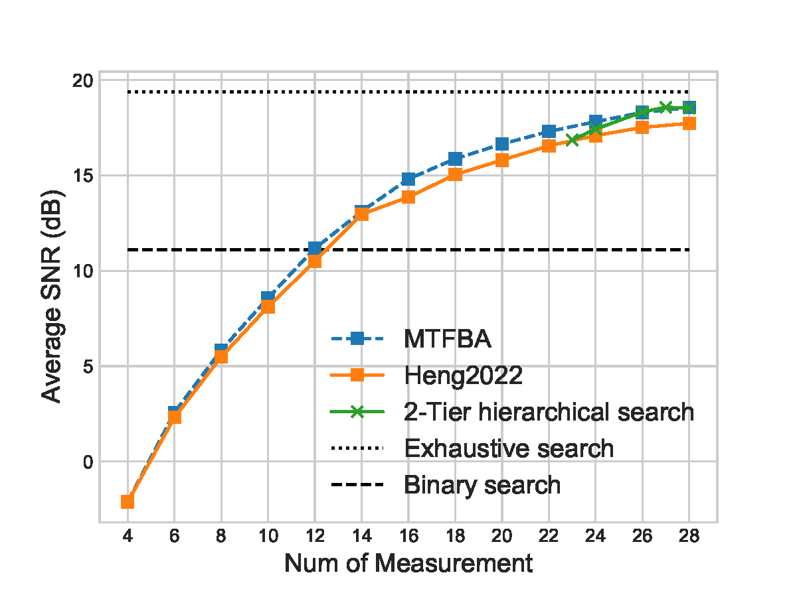
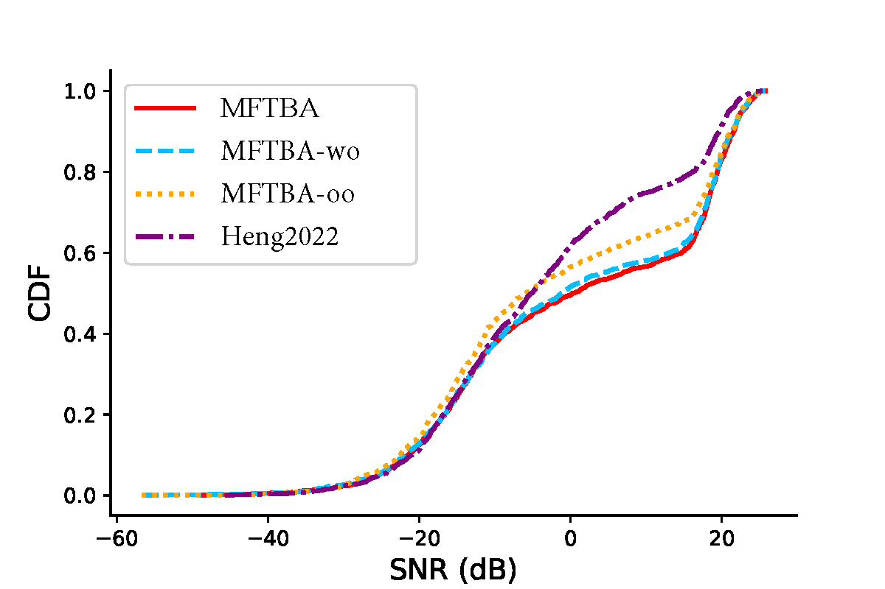

# MTFBA
The code will be release after the acceptance.
##SNR Performance

The goal of this paper is also to identify the candidate beam that achieves the highest SNR, as stated in Problem (8). We use the cross-entropy function to train the neural network, because the candidate codebook has made the SNR maximization decision variable discrete.

Here, we also plot the achieved SNR of the proposed approach and the baselines with increasing probing codebook size. The proposed method consistently outperforms Heng 2022 and the 2-Tier Hierarchical Search Method in terms of SNR as the number of measurements increases. Overall, MTFBA provide extra 3.1% (2.2%∼4.3%) average SNR compared with Heng2022. Furthermore, the advantage increases with the number of measurements.
##Ablation Study from the CDF perspective

In this figure, we also evaluate the achieved SNR distribution across the channels in the testing dataset, to demonstrate how MTFBA improves the performance. When the network condition is poor or very good, all the methods achieve similar SNR. However, when the network condition is fair, the MTFBA selects better beams and enjoys higher SNR. Overall, the curve of MTFBA is in the bottom right corner, which means that MTFBA not only improves the average accuracy, but also improves the mean, lower quartile, median, and upper quartile of throughput. This shows that MTFBA achieves high SNR under various channel conditions.
## Performance in 30dBm

For fair comparison, in the submitted paper, we adopt the same transmit power in [11], which is 10 dBm. We agree with the reviewer that the transmit power of base stations could be 30 dBm. In this response letter, we plot the accuracy comparison with transmit power 30dBm. We can observe that MTFBA provide extra 3.1% average SNR compared with [11]. Therefore, we believe that the proposed multi-task learning framework can improve the beam alignment performance in terms of both accuracy and SNR.
